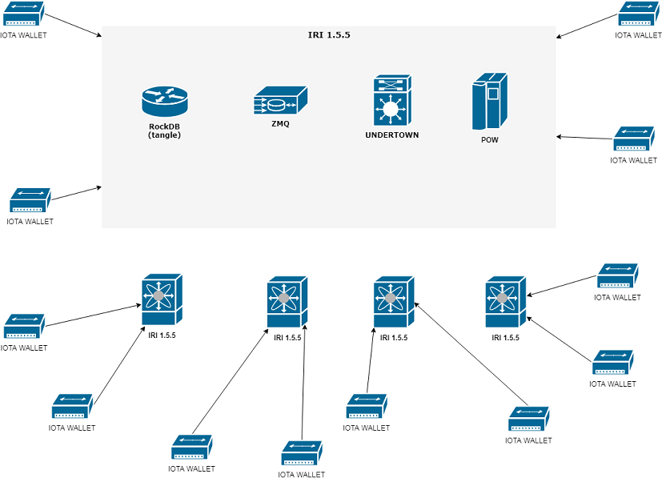
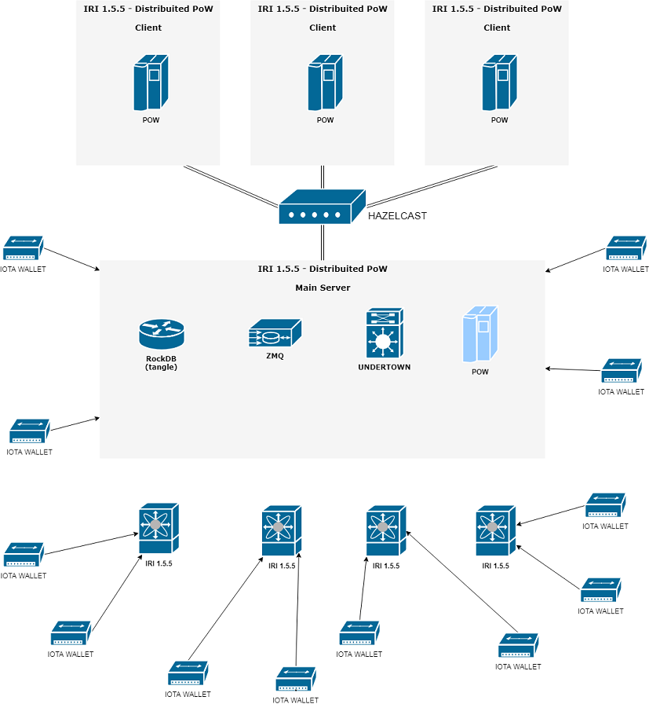

# Distribuited PoW

## The project

This improvements enable iri to delegate the Proof of Work tasks.

## The Architecture

### IRI 1.5.5

### IRI 1.5.5 Distribuited PoW

There are two actors:
 - 1 Main server
 - N Worker

All actors are in the same hazelcast cluster.

Main server execute "attachToTangle" task using Hazelcast Distribuited Task and delegate it into cluster.

Note: main server can be also a worker!

## Main purpose:

PoW task is the bottleneck and it is very important to whole vps performance. My solution help main server to distribute heavy tasks to the cluster.

## How to start it

The feature is into main iri jar. I added some settings:

 - [Server Side]
   - dpow enable flag
   - public server address
   - cluster group id
   - cluster password
 - [Client Side]
   - dpow enable flag
   - remote server address
   - cluster group id
   - cluster password

## DPoW Italian Community Test Infrastructure

- Main Server:
  - fabryprog-iota.eye.rs
- Workers
 - 5.189.144.245
 - 5.189.144.245
 - 193.31.23.255
 - 193.31.23.255

## FAQ

### Main server how to delegate the PoW?

Main server execute PoW method via Hazelcast Distribuited Task send a signal to cluster. There are any methods to select the right worker. I used default method.

### Distribuited PoW executed by one or more workers?

Rate is 1 PoW : 1 worker

### Can you explain the performances?

Initial tests was good.

Now i am working to hazelcast cluster settings to optimize memory load.
